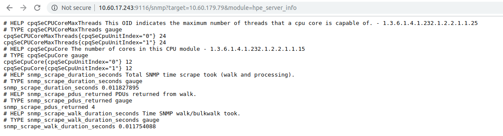

# SNMP exporter 

### Tổng quan SNMP
SNMP (**Simple Network Management Protocol**) là giao thức chuẩn được sử dụng cho việc quản lý, giám sát các thiết bị mạng. SNMP có 3 thành phần cơ bản:
- Managed device.
- SNMP Agent.
- Network manager.

Managed device là các thiết bị mạng được giám sát. Đó có thể là routers, access servers, switches, bridges, hubs, computer hosts, printers,... .

SNMP Agent được cài đặt trên các managed devices. Chức năng của SNMP Agent là thu thập dữ liệu của thiết bị và gửi dữ liệu đó đến Network manager. Agent cũng có thể chủ động gửi một thông tin đến Network manager khi một sự kiện lỗi xảy ra trên thiết bị (cơ chế trap, inform của SNMP).

Network manager là các ứng dụng giám sát. Chúng thu thập thông tin từ các SNMP Agent gửi đến, lưu trữ dữ liệu của toàn bộ các thiết bị mạng trong hệ thống. Đồng thời, thực hiện các chức năng như gửi cảnh báo, hiển thị giao diện giám sát trực quan,...


### SNMP version
SNMP hỗ trợ 3 version là **v1, v2c** và **v3**. Hầu hết các thiết bị mạng đều hỗ trợ cả 3 version của SNMP. Tùy thuộc vào nhu cầu sử dụng để lựa chọn version phù hợp:
- SNMP v1: Đây là version cơ bản nhất của SNMP, version này chỉ hỗ trợ 32 bit counter và khả năng bảo mật kém do community string được gửi ở dạng plaintext.
- SNMP v2c: Version này tương tự với version, điểm khác biệt duy nhất là hỗ trợ 64 bit counter.
- SNMP v3: Đây là version mới nhất của SNMP. Version 3 hỗ trợ cả encryption dữ liệu và authentication. Yêu cầu đối với SNMP v3 là cung cấp user và password, do đó, cần phải thiết lập user SNMP trên các thiết bị cần được giám sát.

**NOTE**: Hiện tại, hệ thống giám sát SNMP đang sử dụng version v2c. Do đó, bước đầu tiên trong giám sát hạ tầng vật lý enable SNMP agent và thiết lập community trên các thiết bị vật lý. Đối với SNMP v3, thiết lập thêm user và password.

### MIB and OID
MIB (**Management Information Base**) là một tập các định nghĩa, được sử dụng để định nghĩa các thuộc tính cho các đối tượng bên trong các thiết bị được quản lý. Đó có thể là các thuộc tính của RAM hay CPU như max capability, current status, location, type,... . Các thuộc tính này sẽ được truy cập bởi SNMP.

Ví dụ về một file MIB:
```
memoryDeviceStateCapabilities                   OBJECT-TYPE
    SYNTAX      StateCapabilitiesFlags
    MAX-ACCESS  read-only
    STATUS      current
    DESCRIPTION
        "1100.0050.0001.0003 This attribute defines the state capabilities of the
        memory device."
    ::= { memoryDeviceTableEntry 3 }
    
memoryDeviceType                                OBJECT-TYPE
    SYNTAX      MemoryDeviceTypeEnum
    MAX-ACCESS  read-only
    STATUS      current
    DESCRIPTION
        "1100.0050.0001.0007 This attribute defines the type of the memory device."
    ::= { memoryDeviceTableEntry 7 }

memoryDeviceLocationName                        OBJECT-TYPE
    SYNTAX      String64
    MAX-ACCESS  read-only
    STATUS      current
    DESCRIPTION
        "1100.0050.0001.0008 This attribute defines the location of the memory device."
    ::= { memoryDeviceTableEntry 8 }
```
Ví dụ trên định nghĩa một số thuộc tính của RAM, mỗi file MIB có thể có các định nghĩa khác nhau. Đối với thuộc tính `memoryDeviceLocationName` sẽ có giá trị trả về ở dạng String, SNMP request chỉ có quyền `read-only` đối với thuộc tính này và description sẽ mô tả ý nghĩa của thuộc tính.

OID (**Object Identifiers**) là một định danh duy nhất ở dạng số cho các thuộc tính của các đối tượng được quản lý trong MIB. Điều này có nghĩa là mỗi thuộc tính của RAM như max capability, current status, location, type,... đều được đại diện bởi một OID.

Hiểu một cách đơn giản thì MIB sẽ định nghĩa các thuộc tính (như description, syntax, max-access), còn OID là địa chỉ của thuộc tính đó. Địa chỉ này là duy nhất cho từng thuộc tính của từng đối tượng trong từng thiết bị mạng.

Cấu trúc của OID:
```
Iso(1).org(3).dod(6).internet(1).private(4).transition(868).products(2).chassis(4).card(1).slotCps(2)­.-cpsSlotSummary(1).cpsModuleTable(1).cpsModuleEntry(1).cpsModuleModel(3).3562.3
```
hoặc 
```
1.3.6.1.4.868.2.4.1.2.1.1.1.3.3562.3
```
OID có cấu trúc dạng cây (như thể hiện ở hình dưới). Các node trong cây OID được gán bởi các tổ chức khác nhau. Bắt đầu từ Root là các stardard organization khác nhau như ITU-T/CCITT, ISO, JOINT-ISO-ITU-T/JOINT-ISO-CCIT. Các vendors định nghĩa các nhánh private khác nhau, các nhánh đó sẽ đại diện bởi các đối tượng trong các sản phẩm của từng vendor.


Ví dụ OID của DELL sẽ là: `1.3.6.1.4.1.674` hay `{iso(1) identified-organization(3) dod(6) internet(1) private(4) enterprise(1) dell(674)}`

OID của Compaq\HPE là:  `1.3.6.1.4.1.232` hay `{iso(1) identified-organization(3) dod(6) internet(1) private(4) enterprise(1) compaq(232)}`

Như vậy, để giám sát thiết bị của hãng nào, chúng ta cần phải có bộ MIBs của thiết bị của hãng đó.

## Sử dụng SNMP trong Prometheus.
Prometheus sử dụng SNMP có một chút thay đổi so với mô hình được nêu ra ở phần đầu bài viết này. Mô hình sử dụng SNMP trong Prometheus được biểu diễn như hình sau:


Như biểu diễn ở hình trên, Prometheus sử dụng SNMP Exporter để thu thập dữ liệu từ SNMP Agent. SNMP Exporter sau đó sẽ convert dữ liệu nhận được từ SNMP Agent sang format mà Prometheus có thể xử lý được. Cơ chế hoạt động cụ thể như sau:
- Prometheus theo thời gian interval, sẽ gửi request đến SNMP Exporter yêu cầu thu thập thông tin các thiết bị mạng. Thông tin request bao gồm `module` (xác định tên của nhóm các metrics sẽ được thu thập) và `target`(địa chỉ IP của thiết bị mạng)
- SNMP Exporter tiếp nhận request từ Prometheus. Từ thông tin `module`, SNMP Exporter sẽ xác định được các metrics cần thu thập dựa vào file cấu hình `snmp.yml`. Sau đó, lần lượt đối với từng metric, SNMP Exporter sẽ gửi các request đến SNMP Agent lấy thông tin metric.
- SNMP Agent respone dữ liệu ở dạng SNMP raw. SNMP exporter sẽ convert dữ liệu raw này sang time serial data. Sau khi thu thập hết tất cả metrics của `module`, SNMP exporter sẽ gửi trả lại thông tin metrics cho Prometheus.
- Prometheus nhận được dữ liệu, lưu trữ vào database và thực hiện một số hành động tiếp theo như đánh giá alert.
- Grafana sẽ sử dụng ngôn ngữ truy vấn PromQL để lấy dữ liệu từ Prometheus database và hiển thị giao diện near-realtime các thông số thu thập được.

## Cấu hình SNMP Exporter.
Có 2 thành phần chính của SNMP exporter là:
- **SNMP exporter**: Là exporter chịu trách nhiệm thu thập dữ liệu SNMP.
- **Generator:** Là thành phần tạo ra file cấu hình `snmp.yml` (dựa theo NETSNMP) được sử dụng bởi SNMP exporter.

### Cài đặt SNMP exporter

Dowload và cài đặt [SNMP exporter](https://github.com/prometheus/snmp_exporter) như sau:
```
$ wget https://github.com/prometheus/snmp_exporter/releases/download/v0.15.0/snmp_exporter-0.15.0.linux-amd64.tar.gz
$ tar -xvzf snmp_exporter-0.15.0.linux-amd64.tar.gz
$ cd snmp_exporter-0.15.0.linux-amd64/
$ ./snmp_exporter 
INFO[0000] Starting snmp exporter (version=0.15.0, branch=HEAD, revision=92a3da4467f8bc6759cf197e7442b8c43e890b13)  source="main.go:139"
INFO[0000] Build context (go=go1.11.5, user=root@8c3a7c03d455, date=20190212-13:40:02)  source="main.go:140"
INFO[0000] Listening on :9116                            source="main.go:226"
```

Theo mặc định, SNMP exporter sẽ đọc file cấu hình `snmp.yml` trong cùng thư mục với file excuate. File cấu hình `snmp.yml` rất khó khăn để viết theo manual way, do đó, **generator** được sử dụng để tự động sinh ra file này thông qua một bộ các file MIBs.

### Cài đặt generator.

Download và cài đặt generator như sau:

```
$ sudo apt-get install golang
$ sudo apt-get install unzip build-essential libsnmp-dev # Debian-based distros

$ go get github.com/prometheus/snmp_exporter/generator
$ cd ${GOPATH-$HOME/go}/src/github.com/prometheus/snmp_exporter/generator
$ go build
```

Sau khi đã có môi trường để tạo ra file cấu hình cho SNMP exporter, việc tiếp theo là copy các file MIBs của thiết bị muốn giám sát vào thư mục `mibs/` trong cùng thư mục execute. Sau đó, chạy câu lệnh sau để enable các file MIBs:

```
$ make mibs/
```

**NOTE**:  File MIBs của từng thiết bị là khác nhau đối với từng hãng khác nhau. Do đó, sau mỗi lần thay đổi một loại thiết bị, cần thay đổi file MIBs đúng với MIBs của thiết bị đó.

Tiếp theo, tạo file config cho **generator** là `generator.yml` với format [tham khảo tại đây](https://github.com/prometheus/snmp_exporter/tree/master/generator#file-format). Một ví dụ như sau:

```
modules:
  hpe_server_info:
    walk:
	  - 1.3.6.1.4.1.232.1.2.2.1.1.15
	  - 1.3.6.1.4.1.232.1.2.2.1.1.25
    version: 2
    timeout: 15s
    auth:
      community: snmpcommunity
  hpe_server_status:
    walk:
	  - 1.3.6.1.4.1.232.1.2.2.1.1.6
	  - 1.3.6.1.4.1.232.18.2.3.1.1.13
    version: 2
    timeout: 10s
    auth:
      community: hpe_status
```   type: gauge
    - labelname: cpqHeFltTolFanIndex
      type: gauge
  version: 2
  timeout: 15s
  auth:
    community: snmpcommunity
```


Ví dụ trên được giải thích như sau:
- **generator** sẽ tạo ra 2 module là `hpe_server_info` và `hpe_server_status`.
- `walk` sẽ khai báo những OID sẽ được tạo ra trong file cấu hình `snmp.yml` của SNMP exporter.  Nếu OID này không phải là giá trị cuối cùng trong cây OID, thì generator sẽ liệt kê hết tất cả các OID là con của OID đó.
- `version` xác định SNMP version sẽ sử dụng.
- `timeout` xác định thời gian mà một request từ SNMP exporter đến SNMP Agent sẽ đợi trước khi bị timeout.
- `auth` xác định các thông tin xác thực như community (đối với v1, v2c và v3), authentication (đối với version v3). Trong ví dụ này là community `snmpcommunity` đối với module `hpe_server_info` và `hpe_status` đối với `hpe_server_status`.

Thực hiện câu lệnh sau để tạo ra file config `snmp.yml`:
```
$ ./generator generate
INFO[0000] Loading MIBs from mibs                        source="net_snmp.go:141"
WARN[0000] NetSNMP reported 2023 parse error(s)          source="main.go:104"
INFO[0000] Generating config for module hpe_server_status  source="main.go:49"
INFO[0000] Generated 2 metrics for module hpe_server_status  source="main.go:60"
INFO[0000] Generating config for module hpe_server_info  source="main.go:49"
INFO[0000] Generated 2 metrics for module hpe_server_info  source="main.go:60"
INFO[0000] Config written to /home/duclh3/go/src/github.com/prometheus/snmp_exporter/generator/snmp.yml  source="main.go:85"
```

Theo mặc định, câu lệnh trên sẽ đọc file cấu hình `generator.yml` và sinh ra file `snmp.yml` trong cùng thư mục execute. File 	snmp.yml` được tạo ra như sau:
```
# WARNING: This file was auto-generated using snmp_exporter generator, manual changes will be lost.
hpe_server_info:
  walk:
  - 1.3.6.1.4.1.232.1.2.2.1.1.15
  - 1.3.6.1.4.1.232.1.2.2.1.1.25
  metrics:
  - name: cpqSeCpuCore
    oid: 1.3.6.1.4.1.232.1.2.2.1.1.15
    type: gauge
    help: The number of cores in this CPU module - 1.3.6.1.4.1.232.1.2.2.1.1.15
    indexes:
    - labelname: cpqSeCpuUnitIndex
      type: gauge
  - name: cpqSeCPUCoreMaxThreads
    oid: 1.3.6.1.4.1.232.1.2.2.1.1.25
    type: gauge
    help: This OID indicates the maximum number of threads that a cpu core is capable
      of. - 1.3.6.1.4.1.232.1.2.2.1.1.25
    indexes:
    - labelname: cpqSeCpuUnitIndex
      type: gauge
  version: 2
  timeout: 15s
  auth:
    community: snmpcommunity
hpe_server_status:
  walk:
  - 1.3.6.1.4.1.232.1.2.2.1.1.6
  - 1.3.6.1.4.1.232.18.2.3.1.1.13
  metrics:
  - name: cpqSeCpuStatus
    oid: 1.3.6.1.4.1.232.1.2.2.1.1.6
    type: gauge
    help: The status of the processor - 1.3.6.1.4.1.232.1.2.2.1.1.6
    indexes:
    - labelname: cpqSeCpuUnitIndex
      type: gauge
    enum_values:
      1: unknown
      2: ok
      3: degraded
      4: failed
      5: disabled
  - name: cpqNicIfPhysAdapterState
    oid: 1.3.6.1.4.1.232.18.2.3.1.1.13
    type: gauge
    help: The fault tolerant state of this adapter - 1.3.6.1.4.1.232.18.2.3.1.1.13
    indexes:
    - labelname: cpqNicIfPhysAdapterIndex
      type: gauge
    enum_values:
      1: unknown
      2: active
      3: standby
      4: failed
  version: 2
  timeout: 10s
  auth:
    community: hpe_status
```

**NOTE**: Công cụ hỗ trợ kiểm tra OID trước khi tạo file cấu hình `generator.yml` là **snmpwalk**. Cách cài đặt và sử dụng như sau:
```
$ apt update
$ apt install snmpd snmp libsnmp-dev
```

Kiểm tra OID `1.3.6.1.4.1.232.6.2.6.7.1` trên thiết bị có IP `10.60.179.79` sử dụng SNMP v2c với community là `snmpcommunity`
```
$ snmpwalk -v 2c -c snmpcommunity 10.60.179.79 1.3.6.1.4.1.232.6.2.6.7.1
SNMPv2-SMI::enterprises.232.6.2.6.7.1.1.0.1 = INTEGER: 0
SNMPv2-SMI::enterprises.232.6.2.6.7.1.1.0.2 = INTEGER: 0
SNMPv2-SMI::enterprises.232.6.2.6.7.1.1.0.3 = INTEGER: 0
SNMPv2-SMI::enterprises.232.6.2.6.7.1.1.0.4 = INTEGER: 0
SNMPv2-SMI::enterprises.232.6.2.6.7.1.1.0.5 = INTEGER: 0
SNMPv2-SMI::enterprises.232.6.2.6.7.1.1.0.6 = INTEGER: 0
SNMPv2-SMI::enterprises.232.6.2.6.7.1.2.0.1 = INTEGER: 1
SNMPv2-SMI::enterprises.232.6.2.6.7.1.2.0.2 = INTEGER: 2
SNMPv2-SMI::enterprises.232.6.2.6.7.1.2.0.3 = INTEGER: 3
```

Quay lại với SNMP exporter, sau khi có được file `snmp.yml`, thực hiện câu lệnh sau để chạy SNMP exporter:
```
./snmp_exporter --log.level="debug"
INFO[0000] Starting snmp exporter (version=0.15.0, branch=HEAD, revision=92a3da4467f8bc6759cf197e7442b8c43e890b13)  source="main.go:139"
INFO[0000] Build context (go=go1.11.5, user=root@8c3a7c03d455, date=20190212-13:40:02)  source="main.go:140"
INFO[0000] Listening on :9116                            source="main.go:226"
```

Truy cập vào web với port `9116`, chọn module và địa chỉ IP của thiết bị. Sau đó, click `submit` thì SNMP exporter sẽ show ra giá trị của các metrics trong module đã được định nghĩa ở file `snmp.yml`. Một số hình ảnh như sau:




Đây là log của SNMP exporter khi nó thực hiện request thông tin các metrics:
```
# ./snmp_exporter --log.level="debug"
INFO[0000] Starting snmp exporter (version=0.15.0, branch=HEAD, revision=92a3da4467f8bc6759cf197e7442b8c43e890b13)  source="main.go:139"
INFO[0000] Build context (go=go1.11.5, user=root@8c3a7c03d455, date=20190212-13:40:02)  source="main.go:140"
INFO[0000] Listening on :9116                            source="main.go:226"
DEBU[0073] Scraping target '10.60.179.79' with module 'hpe_server_info'  source="main.go:87"
DEBU[0073] Walking target "10.60.179.79" subtree "1.3.6.1.4.1.232.1.2.2.1.1.15"  source="collector.go:156"
DEBU[0073] Walk of target "10.60.179.79" subtree "1.3.6.1.4.1.232.1.2.2.1.1.15" completed in 6.275891ms  source="collector.go:166"
DEBU[0073] Walking target "10.60.179.79" subtree "1.3.6.1.4.1.232.1.2.2.1.1.25"  source="collector.go:156"
DEBU[0073] Walk of target "10.60.179.79" subtree "1.3.6.1.4.1.232.1.2.2.1.1.25" completed in 5.049087ms  source="collector.go:166"
DEBU[0073] Scrape of target '10.60.179.79' with module 'hpe_server_info' took 0.012340 seconds  source="main.go:98"
```

Output có thể xác định khoảng thời gian xấp xỉ để query một module. Thông tin này sẽ dùng để xác định timeout khi config prometheus.
 
 
 ## Tích hợp vào Prometheus
 
 [TODO]
